  

  
  
  
  
  
  

---

### 👨‍💻 About Me

- 🧠 **ML & SW Engineer**
- 🎓 **B.Sc. Computer Science & Software Engineering** at Universitat de Barcelona
- 🏆 Thesis on **transformer-based classification of breast cancer molecular subtypes**
- 🔬 Interested in **transformer architectures, computer vision, machine learning and software engineering**
- 🌍 Based in **Barcelona, Spain**
- 🗣️ Spanish (native) · Catalan (B2) · English (B2)
---

### 🛠️ Tech Stack

**ML, Deep Learning & Data**

**MLOps & Infrastructure**

**Backend & APIs**

**Frontend**

### 🏅 Certifications

  
  
  
  
  
  

  

---

### 📊 GitHub Stats

<table align="center">
  <tr>
    <td align="center" width="50%">
        
    </td>
    <td align="center" width="50%">
      
    </td>
  </tr>
</table>

<table align="center">
  <tr>
    <td align="center" width="50%">
      
    </td>
    <td align="center" width="50%">
      
    </td>
  </tr>
</table>
